<!-- 📚 [SHARED-INFRASTRUCTURE] -->
<!-- Documentation component -->

```mermaid
sequenceDiagram
    participant WS as WebSocket<br/>Binance API
    participant KAFKA as Kafka<br/>Message Bus
    participant STRAT as Strategy<br/>Engine
    participant PAIRS as Pairs Trading<br/>Cointegration
    participant ML as ML Pipeline<br/>LSTM/RL
    participant AGG as Signal<br/>Aggregator
    participant RISK as Risk<br/>Manager
    participant PORT as Portfolio<br/>Manager
    participant EXEC as Execution<br/>Engine
    participant BROKER as Broker<br/>Interface
    participant PROM as Prometheus<br/>Monitoring

    Note over WS,BROKER: 🚀 Real-time Trading Flow (<10ms latency)
    
    %% Data Ingestion Phase
    WS->>KAFKA: Market Data Stream
    Note right of KAFKA: Topic: market_data<br/>Partition: by symbol
    
    KAFKA->>STRAT: Subscribe to data
    STRAT->>PAIRS: Price data
    STRAT->>ML: Feature vectors
    
    %% Strategy Processing Phase
    Note over PAIRS,ML: 🧠 Parallel Strategy Execution
    
    PAIRS->>PAIRS: Cointegration Test<br/>Johansen method
    PAIRS->>PAIRS: Calculate Z-score<br/>Mean reversion
    PAIRS->>AGG: Pairs Signal<br/>(strength: 0.85)
    
    ML->>ML: LSTM Prediction<br/>Next 5 candles
    ML->>ML: RL Action<br/>DQN decision
    ML->>AGG: ML Signal<br/>(confidence: 0.92)
    
    %% Signal Aggregation
    AGG->>AGG: Weight signals<br/>Consensus voting
    AGG->>RISK: Combined Signal<br/>(BUY, strength: 0.88)
    
    %% Risk Management Phase
    Note over RISK,PORT: 🛡️ Risk & Portfolio Validation
    
    RISK->>RISK: VaR Calculation<br/>Position limit check
    RISK->>RISK: Kelly Criterion<br/>Optimal position size
    RISK->>PORT: Risk-approved signal
    
    PORT->>PORT: Portfolio impact<br/>Correlation check
    PORT->>PORT: Asset allocation<br/>Rebalancing needs
    PORT->>EXEC: Execution order<br/>(quantity: 0.1 BTC)
    
    %% Execution Phase
    Note over EXEC,BROKER: 🎯 Smart Order Execution
    
    EXEC->>EXEC: Order optimization<br/>TWAP/VWAP logic
    EXEC->>BROKER: Place order<br/>Limit price
    
    BROKER->>BROKER: Order filled<br/>Partial/Complete
    BROKER->>EXEC: Fill confirmation
    
    %% Monitoring & Feedback
    EXEC->>KAFKA: Trade executed
    Note right of KAFKA: Topic: trades<br/>Audit trail
    
    EXEC->>PROM: Execution metrics
    RISK->>PROM: Risk metrics
    PORT->>PROM: Portfolio metrics
    PAIRS->>PROM: Strategy metrics
    ML->>PROM: Model metrics
    
    Note over PROM: 📊 Real-time monitoring<br/>Grafana dashboards
```

# ⚡ TRADING EXECUTION FLOW
**Real-time Signal Generation to Trade Execution**

## 🎯 Process Overview

### Phase 1: Data Ingestion (0-2ms)
- **WebSocket**: Receives real-time market data from Binance
- **Kafka**: Distributes data to strategy engines via pub-sub
- **Partitioning**: Data partitioned by symbol for parallel processing

### Phase 2: Strategy Processing (2-8ms)
**Parallel Execution of Multiple Strategies:**

#### Pairs Trading Strategy:
1. **Cointegration Test**: Johansen method for statistical arbitrage
2. **Z-score Calculation**: Mean reversion signal strength
3. **Signal Generation**: BUY/SELL with confidence score

#### ML Pipeline:
1. **LSTM Prediction**: Next 5 candles price movement
2. **RL Decision**: DQN agent action selection
3. **Signal Output**: ML-based BUY/SELL recommendation

### Phase 3: Signal Aggregation (8-9ms)
- **Consensus Voting**: Weight signals by historical performance
- **Meta-Strategy**: Combine multiple strategy outputs
- **Final Signal**: Single BUY/SELL decision with strength

### Phase 4: Risk Management (9-10ms)
#### Risk Manager:
- **VaR Calculation**: Value at Risk assessment
- **Position Limits**: Maximum exposure validation
- **Kelly Criterion**: Optimal position sizing

#### Portfolio Manager:
- **Correlation Check**: Portfolio diversification
- **Asset Allocation**: Current vs target weights
- **Rebalancing**: Auto-adjustment recommendations

### Phase 5: Execution (10-15ms)
#### Execution Engine:
- **Order Optimization**: TWAP/VWAP algorithms
- **Smart Routing**: Best execution venue
- **Risk Controls**: Final validation before sending

#### Broker Interface:
- **Order Placement**: REST API call to exchange
- **Fill Monitoring**: Real-time order status
- **Confirmation**: Trade execution feedback

### Phase 6: Monitoring & Feedback (Continuous)
- **Metrics Collection**: All components send metrics to Prometheus
- **Dashboard Updates**: Real-time Grafana visualization
- **Audit Trail**: GDPR-compliant logging via Kafka

## 📊 Performance Metrics

- **Total Latency**: <15ms from market data to order placement
- **Strategy Processing**: <6ms for 30+ parallel strategies
- **Risk Assessment**: <2ms for comprehensive risk checks
- **Execution Optimization**: <5ms for smart order routing

## 🔄 Error Handling

- **Timeout Protection**: Circuit breakers for slow components
- **Fallback Strategies**: Degraded mode operation
- **Retry Logic**: Exponential backoff for failed operations
- **Alert System**: Immediate notification of critical failures

## 🛡️ Compliance Features

- **GDPR Logging**: Personal data anonymization
- **Audit Trail**: Complete trade lifecycle tracking
- **Risk Controls**: Automated position limit enforcement
- **Regulatory Reporting**: Real-time compliance monitoring
