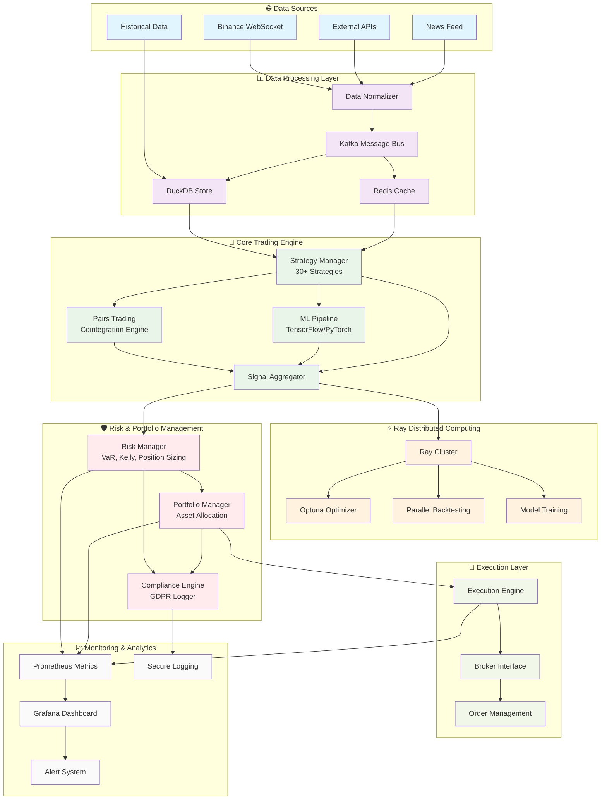

<!-- 📚 [SHARED-INFRASTRUCTURE] -->
<!-- Documentation component -->

# 🏗️ SYSTEM ARCHITECTURE DIAGRAM
**Complete Trading Bot Architecture - 2025 Enterprise Level**

## 📋 Component Details

### 🌐 Data Sources Layer
- **Binance WebSocket**: Real-time market data (<10ms latency)
- **External APIs**: Economic indicators, news sentiment
- **Historical Data**: CSV files for backtesting (252+ days)
- **News Feed**: Sentiment analysis for fundamental signals

### 📊 Data Processing Layer
- **Data Normalizer**: Standardizes data formats across sources
- **Kafka Message Bus**: Event-driven architecture, pub-sub pattern
- **DuckDB Store**: High-performance analytical database
- **Redis Cache**: Sub-millisecond data access for real-time trading

### 🧠 Core Trading Engine
- **Strategy Manager**: Orchestrates 30+ trading strategies
- **Pairs Trading**: Johansen cointegration, correlation analysis
- **ML Pipeline**: TensorFlow 2.13+, LSTM, RL algorithms
- **Signal Aggregator**: Combines and weights multiple signals

### ⚡ Ray Distributed Computing
- **Ray Cluster**: Distributed computing for scalability
- **Optuna Optimizer**: Hyperparameter optimization
- **Parallel Backtesting**: Concurrent strategy testing
- **Model Training**: Distributed ML model training

### 🛡️ Risk & Portfolio Management
- **Risk Manager**: VaR, Kelly criterion, position sizing
- **Portfolio Manager**: Asset allocation, rebalancing
- **Compliance Engine**: GDPR-compliant logging, audit trails

### 🎯 Execution Layer
- **Execution Engine**: Smart order routing
- **Broker Interface**: Multi-broker connectivity
- **Order Management**: Order lifecycle management

### 📈 Monitoring & Analytics
- **Prometheus**: Metrics collection and storage
- **Grafana**: Real-time dashboards and visualization
- **Alert System**: Automated notifications and alerts
- **Secure Logging**: GDPR-compliant audit trails

## 🔄 Data Flow Description

1. **Data Ingestion**: Multiple sources → Normalizer → Kafka
2. **Strategy Processing**: Kafka → Strategies → Signal generation
3. **Risk Assessment**: Signals → Risk Manager → Portfolio validation
4. **Execution**: Approved signals → Execution Engine → Broker
5. **Monitoring**: All components → Prometheus → Grafana dashboards

## 🚀 Key Features

- **Real-time Processing**: <10ms market data to signal generation
- **Distributed Computing**: Ray cluster for scalability
- **Enterprise Security**: GDPR compliance, secure logging
- **High Availability**: Redundant components, failover mechanisms
- **Monitoring**: Comprehensive metrics and alerting
