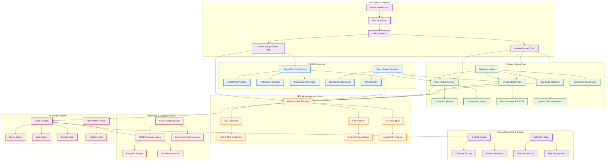

```mermaid
graph TD
    subgraph "🔒 Security & Compliance Layer"
        A[SecureConfigManager] --> B[GDPR Compliant Logger]
        A --> C[HashiCorp Vault Integration]
        B --> D[Encrypted Storage]
        B --> E[Data Anonymization]
    end

    subgraph "📡 Data Ingestion Pipeline"
        F[Binance WebSocket] --> G[Data Normalizer]
        G --> H[Kafka Producer]
        H --> I[market-data-raw Topic]
        H --> J[market-data-processed Topic]
    end

    subgraph "🧠 Strategy Engine Core"
        K[Strategy Interface] --> L[Pairs Trading Strategy]
        K --> M[Enhanced RSI Turbo]
        K --> N[Grid Trading Strategy]
        K --> O[Mean Reversion Strategy]
        
        L --> P[Correlation Analysis]
        L --> Q[Cointegration Testing]
        M --> R[Ultra-Optimized RSI 66/29]
        N --> S[Dynamic Grid Management]
    end

    subgraph "🛡️ Risk Management System"
        T[Advanced Risk Manager] --> U[VaR Calculator]
        T --> V[Kelly Criterion]
        T --> W[ML Risk Engine]
        U --> X[95% & 99% Confidence]
        V --> Y[Optimal Position Sizing]
        W --> Z[Neural Risk Prediction]
    end

    subgraph "🤖 ML/AI Integration"
        AA[TensorFlow 2.15+ Engine] --> BB[LSTM Price Predictor]
        AA --> CC[CNN Signal Classifier]
        AA --> DD[Transformer Risk Model]
        EE[Ray + Optuna Optimizer] --> FF[Distributed Optimization]
        EE --> GG[TPE Algorithm]
    end

    subgraph "💾 Data Processing & Storage"
        HH[DuckDB Adapter] --> II[Columnar Storage]
        HH --> JJ[Real-time Analytics]
        KK[Kafka Event Bus] --> LL[Stream Processing]
        KK --> MM[Topic Management]
    end

    subgraph "⚡ Execution Engine"
        NN[Order Manager] --> OO[Market Orders]
        NN --> PP[Limit Orders]
        NN --> QQ[Portfolio State]
        RR[Performance Tracker] --> SS[Real-time P&L]
    end

    %% Data Flow Connections
    I --> L
    I --> M
    I --> N
    J --> AA
    J --> T

    L --> T
    M --> T
    N --> T

    T --> NN
    AA --> T
    EE --> L
    EE --> M

    NN --> HH
    NN --> B
    
    %% Style Classes
    classDef security fill:#ffebee,stroke:#c62828,stroke-width:2px
    classDef strategy fill:#e8f5e8,stroke:#2e7d32,stroke-width:2px
    classDef risk fill:#fff3e0,stroke:#f57c00,stroke-width:2px
    classDef ml fill:#e3f2fd,stroke:#1565c0,stroke-width:2px
    classDef data fill:#f3e5f5,stroke:#7b1fa2,stroke-width:2px
    classDef execution fill:#fce4ec,stroke:#ad1457,stroke-width:2px

    %% Apply Styles
    class A,B,C,D,E security
    class K,L,M,N,O,P,Q,R,S strategy
    class T,U,V,W,X,Y,Z risk
    class AA,BB,CC,DD,EE,FF,GG ml
    class F,G,H,I,J,HH,II,JJ,KK,LL,MM data
    class NN,OO,PP,QQ,RR,SS execution
```
